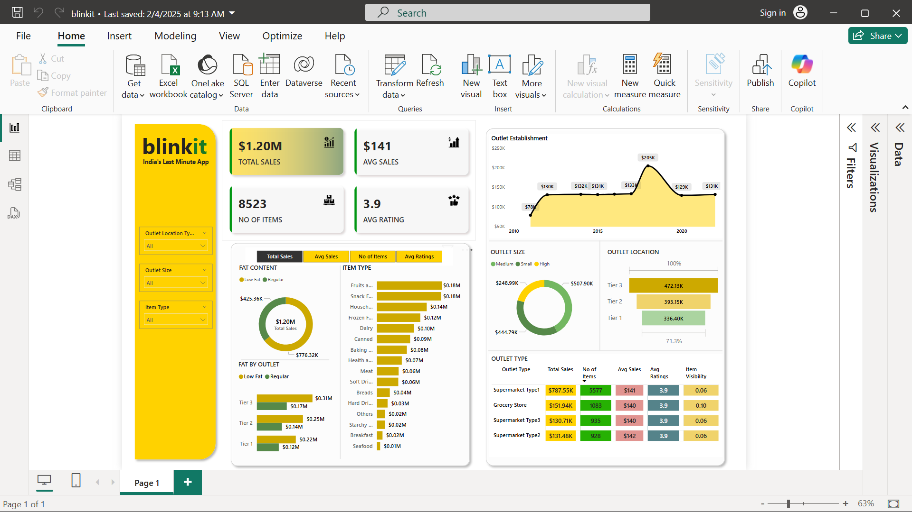

# power-bi-dashboard-binkit
This Power BI project delivers comprehensive sales analytics for Blinkit (India's last-minute delivery app), enabling data-driven decision-making through interactive visualizations and key performance indicators.
Project Objective:
Conduct a comprehensive analysis of Blinkit's sales performance, customer satisfaction, and inventory distribution to identify key insights and opportunities for optimization using various KPIs and visualizations in Power BI.

## Business Requirement 
[Problem statement](docs/business_requirements.md)

## 🔄 Project Workflow
This project follows a structured 11-step methodology:

1. Requirement Gathering/Business Requirements - Define stakeholder needs and KPIs
2. Data Walkthrough - Understand data structure and sources
3. Data Connection - Import data into Power BI
4. Data Cleaning/Quality Check - Handle missing values, duplicates, and inconsistencies
5. Data Modeling - Create relationships between tables
6. Data Processing - Transform and prepare data for analysis
7. DAX Calculations - Create measures and calculated columns
8. Dashboard Layout - Design wireframe and layout structure
9. Charts Development and Formatting - Build visualizations per requirements
10. Dashboard/Report Development - Integrate all components
11. Insights Generation - Extract actionable business insights

## Dashboard

## 📊 Dashboard Features
**Sales Performance Analysis**

- Total sales overview with KPI cards
- Average transaction value tracking
- Item count and inventory metrics

 **Product Category Insights**

- Sales breakdown by 16 product categories
- Top performers: Fruits & Vegetables, Snacks, Household items
- Fat content preference analysis (Low Fat vs Regular)

**Outlet Performance Metrics**

- Performance by outlet size (Small, Medium, High)
- Geographic distribution across Tier 1, 2, and 3 locations
- Outlet establishment timeline (2010-2020)
- Comparative analysis across outlet types

**Interactive Filtering**

- Dynamic slicers for outlet location type
- Outlet size filters
- Item type selection
- Cross-filtering across all visualizations

## 🛠️ Technologies Used

- Power BI Desktop - Dashboard development and visualization
- Power Query - Data transformation and ETL
- DAX (Data Analysis Expressions) - Calculated measures and KPIs
- Excel/CSV - Data source format

  ## 📝 Data Notes

- Data Period: 2010-2020
- Data Source: Blinkit sales records (sample/anonymized data)
- Update Frequency: Static dataset for analysis demonstration
- Data Quality: Pre-cleaned and validated

## 🔒 Privacy & Ethics
This project uses publicly available sample data for educational and portfolio demonstration purposes. No confidential or proprietary business information is included.

## 🎓 Learning Outcomes
This project demonstrates proficiency in:

- Business requirement analysis and KPI definition
- Data modeling and relationship management
- Power BI visualization best practices
- Interactive dashboard design
- DAX formula implementation
- Data storytelling and insight generation
- End-to-end BI project execution
